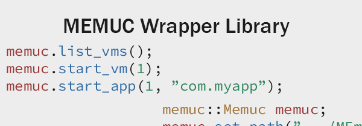

## Features
- Get a list VMs
- Start/stop/restart VMs
- Start/stop applications
- Trigger keys, touch and swipes
- Screen capture without save images
- Get list a running processes of VM

## Examples

The ```memuc::Memuc``` provides API for interact with MEMUC (MEmu Command).

### Get a list VMs

```c
memuc::Memuc memuc;
memuc.set_path("C:/Program Files/Microvirt/MEmu/");
memuc.list_vms();
```

### Run VM and application, then trigger keys

```c
memuc::Memuc memuc;
memuc.set_path("C:/Program Files/Microvirt/MEmu/");
memuc.start_vm(0);
memuc.start_app(0, "com.myapp");
memuc.trigger_key(0, memuc::KeyCode::Back);
```

## Thirdparties

- [stb](https://github.com/nothings/stb)
