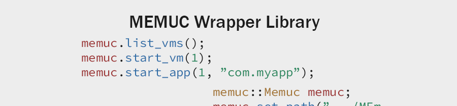

## Features
- [x] Gets list of the VMs
- [x] Starts/stops/restarts the VMs
- [x] Starts/stops the applications
- [x] Triggers keys, touches and swipes
- [x] Takes the screen captures without save images on disk (into memory buffer)
- [x] Gets list of the running VM's processes

## Examples

### Returns list of the VMs

The ```memuc::Memuc``` provides API for interacting with MEmu command.
```c++
memuc::Memuc memuc(0, memuc::VMConfig::Default());
memuc.list_vms();
```

### Runs the VM and the application, then triggers keys

```c++
memuc::Memuc memuc(0, memuc::VMConfig::Default());
memuc.start_app(0, "com.myapp");
memuc.trigger_key(0, memuc::KeyCode::Back);
```

### Changes default MEmu command path

```c++
memuc::memuc_path = "D:/Program Files/Microvirt/MEmu/memuc.exe";
```